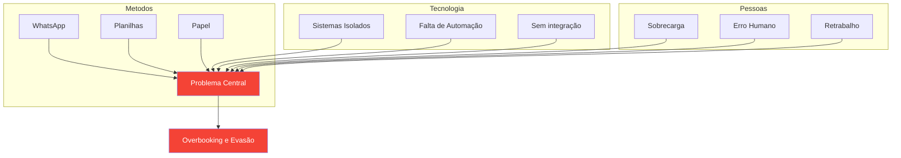

  <h1 style="color: white;">🚀 UnBilidade</h1>
  
Sistema de Gestão Inteligente para Clínicas de Fisioterapia

## 📊 Contexto de Negócio

O setor de clínicas de fisioterapia enfrenta um desafio único: **o tempo é o produto**. Cada hora não atendida representa receita perdida.

  

62%

Usam WhatsApp para agendamento

  

28%

Cancelamentos de última hora

  

15h/sem

Gastas com agendamento manual

---

## 🤖 DEMONSTRADOR AO VIVO: Automação de Agenda Inteligente

  

    

      ⚡ UnBilidade - Simulador de Agendamento Automático
    

    

      🟢 Sistema Online
    

  

  
  

    <!-- Horários serão gerados via JavaScript -->
  

  
  

    

      
📊 Taxa de Ocupação

      
0%

    

    

      
✅ Horários Livres

      
0

    

    

      
🔒 Horários Ocupados

      
0

    

    

      
⏳ Reservados (5min)

      
0

    

  

  
  

    <button class="btn-action" id="simularCancelamentoBtn">❌ Simular Cancelamento</button>
    <button class="btn-action" id="resetarAgendaBtn">🔄 Resetar Agenda</button>
    <button class="btn-action" id="autopreenchimentoBtn">✨ Autopreenchimento Inteligente</button>
  

  
  

    
[SISTEMA] Dashboard carregado. Clique em um horário disponível para simular um agendamento!

  

---

## 🔍 Análise de Causa (Ishikawa)

⚠️ O Problema

 <h3>🚨 A Fragmentação dos Processos</h3> 
A marcação de consultas ocorre de forma manual via WhatsApp e redes sociais.
 
<strong>Consequências:</strong>
 <ul> <li>📉 Overbooking - dupla reserva de horários</li> <li>💸 Evasão de horários - janelas vazias</li> <li>😰 Fadiga da equipe - tarefas repetitivas</li> <li>🔓 Insegurança de dados</li> </ul> 

💡 A Solução

 <h3>✨ UnBilidade</h3> 
Plataforma web que centraliza e automatiza todo o fluxo de agendamentos.
 

 

🤖
<h4>Automação Inteligente</h4>
Preenche vagas remanescentes automaticamente

 

🔔
<h4>Notificações</h4>
Lembretes automáticos 24h antes

 

📊
<h4>Dashboards</h4>
Métricas em tempo real

 

🔒
<h4>LGPD Compliance</h4>
Dados protegidos

 

🎯 Comparação

 
 <h3>❌ Modelo Tradicional</h3> 
📱 WhatsApp + 📝 Planilha
 
⏱️ Resposta: horas/dias
 
📊 Ocupação: 65%
 
 
 <h3>✨ UnBilidade</h3> 
🤖 Automação + ⚡ Tempo real
 
⏱️ Resposta: segundos
 
📊 Ocupação: 92%+
 
 

👥 Personas
Persona	Funcionalidades
🧑‍⚕️ Fisioterapeuta	Agenda do dia, evolução clínica, remarcações
👩‍💼 Secretária	Gerencia horários, lista de atendimentos
🧑‍🤝‍🧑 Paciente	Marca online, cancelamento autônomo, histórico
📈 ROI Esperado

<strong>Redução de cancelamentos:</strong> 28% → 12% -57%
 

<strong>Aumento de ocupação:</strong> 65% → 92% +42%
 

<strong>Tempo economizado:</strong> 15h/semana -70%
 

🎯 UnBilidade não é apenas uma agenda digital - é um ecossistema inteligente que transforma a gestão da clínica.